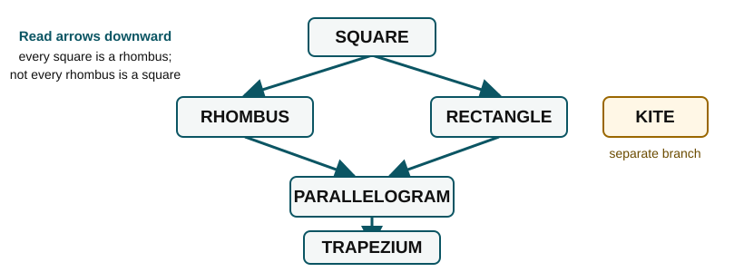
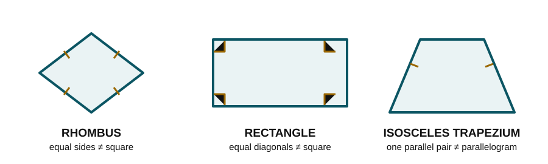
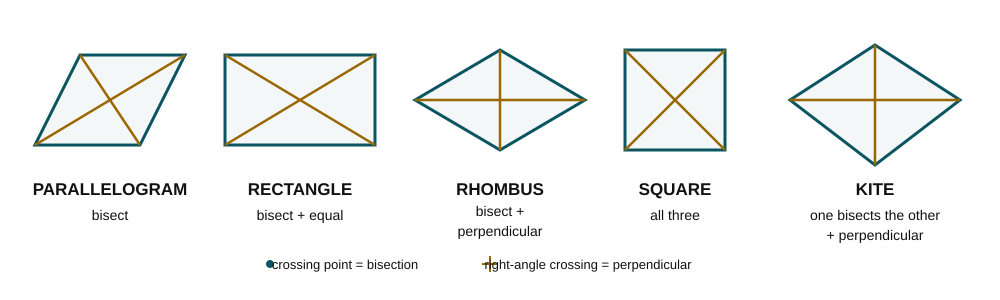
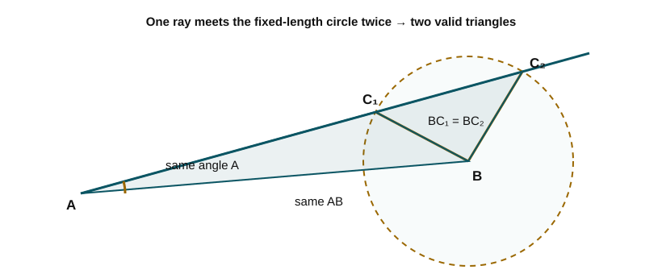
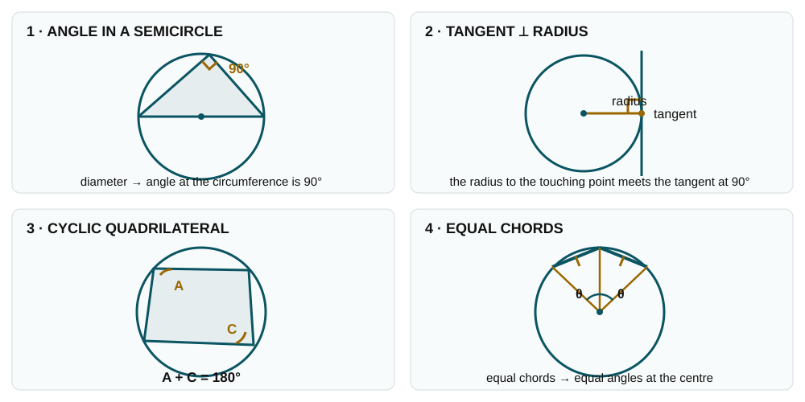

::: {.callout-important}
## Why this page exists

**Eight sittings, eight appearances.** Every TMUA Paper 2 from 2016 to 2023 has contained a question that
takes a plane figure — a triangle, a quadrilateral, a polygon in a circle — and asks about it in the
language of **necessary and sufficient**, or **converse and contrapositive**.

The geometry never goes beyond GCSE. What is tested is whether you can say *which property forces which*,
and produce the **standard counterexample** on demand. That is a memorising job, and this page is the list.

*The S-sessions are organised by **reasoning type**; the T-sessions are the **topic** that carries it.
Companion page: [T1 — Divisors & Primes](t01_divisors_primes.qmd).*
:::

::: {.callout-note}
## How to read the notation on this page

- $X\Rightarrow Y$ means **every $X$ is a $Y$**. The arrow points from the stronger description to the
  weaker one; it does not automatically run backwards.
- $PQ=SR$ compares the **lengths** of the two sides. (Some books write $|PQ|=|SR|$; we avoid those extra
  bars here.)
- $PQ\parallel SR$ means the sides are **parallel**, and $PQ\perp SR$ means they are **perpendicular**.

**Memory line:** *an arrow is a one-way promise; a counterexample tests the return journey.*
:::

::::: {.formulasheet}

:::: {.fs-head}

TMUA · Paper 2 · Topic session T2

Shapes as Logical Conditions

The quadrilateral lattice, the diagonal table, the congruence criteria and the three counterexamples that answer most of these questions. Learn the <strong>arrows</strong> — which property implies which — because every question here is asking you to read one off.

::::

## The core cards

:::: {.fs-grid}

::: {.fs-card}
### 1 · [square $\Rightarrow$ rhombus / rectangle $\Rightarrow$ parallelogram $\Rightarrow$ trapezium]{.hl}

$$\text{square}\Rightarrow\text{rhombus}\Rightarrow\text{parallelogram}\Rightarrow\text{trapezium}$$
$$\text{square}\Rightarrow\text{rectangle}\Rightarrow\text{parallelogram}$$

A square is **both** a rhombus and a rectangle; nothing else is. A **kite** sits outside this chain — it is
not a parallelogram unless it is a rhombus.

{.shape-diagram fig-alt="Quadrilateral family tree showing one-way implication arrows"}

| shape | definition to memorise |
|---|---|
| **quadrilateral** | a polygon with **four sides** |
| **trapezium** | a quadrilateral with **at least one pair of opposite sides parallel** |
| **parallelogram** | a quadrilateral with **both pairs of opposite sides parallel** |
| **rectangle** | a parallelogram with **four right angles** |
| **rhombus** | a parallelogram with **four equal sides** |
| **square** | a quadrilateral with **four equal sides and four right angles** — both a rectangle and a rhombus |
| **kite** | a quadrilateral with **two pairs of adjacent equal sides** |

An **isosceles trapezium** has one pair of parallel sides and equal non-parallel sides. Its base angles and
diagonals are equal, but it need not be a parallelogram. TMUA uses the British word **trapezium**; American
sources usually call it a **trapezoid**.

*Arrows run one way only.* Reading one backwards is what every wrong option in this topic does.

| statement | | why |
|---|:-:|---|
| Every square is a rhombus | **True** | *four equal sides* |
| Every square is a rectangle | **True** | *four right angles* |
| *Converse:* every rhombus is a square | **False** | *angles need not be $90^\circ$* |
| Every kite is a parallelogram | **False** | *only if it is a rhombus* |

[2019 Q10 · 2020 Q7]{.eg}
:::

::: {.fs-card}
### 2 · [rhombus · rectangle · isosceles trapezium — the three counterexamples]{.hl}

- **rhombus** — equal sides, diagonals perpendicular, **but not a square**
- **rectangle** — equal diagonals, all angles $90^\circ$, **but not a square**
- **isosceles trapezium** — one pair parallel, other pair equal, **but not a parallelogram**

Almost every "is this sufficient?" question in this topic is killed by one of these three.

{.shape-diagram fig-alt="Rhombus, rectangle, and isosceles trapezium with their relevant properties marked"}

| statement | | why |
|---|:-:|---|
| A rhombus has perpendicular diagonals | **True** | *and they bisect* |
| A rhombus has **equal** diagonals | **False** | *that would make it a square* |
| A rectangle has equal diagonals | **True** | *but not perpendicular* |
| An isosceles trapezium is a parallelogram | **False** | *only one pair is parallel* |

[2020 Q7's answer is "none of them" — rhombus kills two conditions, rectangle the third]{.eg}
:::

::: {.fs-card}
### 3 · [Each diagonal condition is an **iff** for its shape]{.hl}

For a quadrilateral, these conditions work in **both directions**:

| diagonal condition | shape guaranteed |
|---|---|
| diagonals **bisect each other** | parallelogram |
| diagonals bisect each other **and are equal** | rectangle *(possibly a square)* |
| diagonals bisect each other **and are perpendicular** | rhombus *(possibly a square)* |
| diagonals bisect each other, are equal **and** perpendicular | square |
| **one** diagonal perpendicularly bisects the other | kite *(possibly a rhombus or square)* |

For example,
$$\text{diagonals bisect each other}\iff\text{the quadrilateral is a parallelogram}.$$

The rows do not always name one exclusive category: a square also satisfies the rectangle, rhombus and
parallelogram rows. Read “rectangle” as **at least a rectangle**, not “rectangle but not a square”. Each row
is necessary and sufficient under these inclusive definitions. *This table is the single most useful thing
on the page* — most nec/suff options are one of its rows, altered.

{.shape-diagram fig-alt="Five quadrilaterals with equal, perpendicular, and bisected diagonals marked"}

| statement | | why |
|---|:-:|---|
| Diagonals bisect each other $\iff$ parallelogram | **True** | *row 1* |
| Diagonals bisect **and** are equal $\iff$ rectangle | **True** | *row 2* |
| Diagonals bisect **and** are perpendicular $\iff$ rhombus | **True** | *row 3* |
| *Trap:* perpendicular diagonals alone $\Rightarrow$ rhombus | **False** | *the bisection half is missing* |

[2018 Q5 · 2020 Q7 · 2022 Q11]{.eg}
:::

::: {.fs-card}
### 4 · [One pair both equal **and** parallel forces a parallelogram]{.hl}

**Sufficient** — each of these alone:

- both pairs of opposite sides parallel;
- both pairs of opposite sides equal;
- the **same one pair** of opposite sides is both equal **and** parallel;
- diagonals bisect each other.

Suppose the vertices go around the quadrilateral as $A,B,C,D$. The third condition means
$$AB=CD\quad\textbf{and}\quad AB\parallel CD.$$
The equality and parallelism both describe the **same opposite pair**, $AB$ and $CD$. That alone forces
$ABCD$ to be a parallelogram.

**Not sufficient — the exam's favourite:** one pair *equal* but a **different pair** *parallel*, for example
$$AB=CD\quad\textbf{but}\quad AD\parallel BC.$$
That information can describe an isosceles trapezium, so it does not force a parallelogram.

| statement | | why |
|---|:-:|---|
| $AB=CD$ **and** $AB\parallel CD$ $\Rightarrow$ parallelogram | **True** | *same pair* |
| *Trap:* $AB=CD$ **and** $AD\parallel BC$ $\Rightarrow$ parallelogram | **False** | *isosceles trapezium* |
| Both pairs of opposite sides equal $\Rightarrow$ parallelogram | **True** | *sufficient on its own* |

[2019 Q10 turns entirely on this distinction]{.eg}
:::

::: {.fs-card}
### 5 · [SSS · SAS · ASA · AAS · RHS are criteria — **SSA is not**]{.hl}

**Criteria:** SSS · SAS · ASA · AAS · RHS.

**RHS** means **Right angle–Hypotenuse–Side**: two right-angled triangles are congruent if their
hypotenuses and one pair of corresponding sides are equal.

**SSA is not a criterion.** Two sides and a *non-included* angle can give **two** different triangles — the
ambiguous case.

{.shape-diagram fig-alt="Two possible triangles satisfying the same SSA information"}

*Equal area is also not a criterion:* $\tfrac12ab\sin C$ equal gives only $\sin C_1=\sin C_2$.

| statement | | why |
|---|:-:|---|
| Two sides and the **included** angle give congruence | **True** | *SAS* |
| Two sides and a **non-included** angle give congruence | **False** | *SSA — the ambiguous case* |
| Equal areas with two equal sides give congruence | **False** | *only $\sin C_1=\sin C_2$* |

[2016 Q9 · 2021 Q18]{.eg}
:::

::: {.fs-card}
### 6 · [$\sin A=\sin B\iff B=A$ or $B=180^\circ-A$]{.hl}

$$\sin A=\sin B\iff B=A\ \text{ or }\ B=180^\circ-A$$

In a triangle both branches can be genuine, which is exactly why SSA fails and why "equal areas" never
closes a congruence argument.

$\sin30^\circ=\sin150^\circ$, $\sin50^\circ=\sin130^\circ$.

| statement | | why |
|---|:-:|---|
| $\sin30^\circ=\sin150^\circ$ | **True** | *supplementary angles* |
| *Trap:* $\sin A=\sin B\Rightarrow A=B$ | **False** | *$B=180^\circ-A$ is allowed* |
| In a triangle both branches can be genuine | **True** | *this is why SSA fails* |

[the hinge of 2016 Q9; also S7's checklist item 6]{.eg}
:::

::: {.fs-card}
### 7 · [interior sum $=(n-2)180^\circ$; regular interior $=180^\circ-\tfrac{360^\circ}{n}$]{.hl}

$$\text{interior sum}=(n-2)\times180^\circ,\qquad
\text{regular interior}=180^\circ-\frac{360^\circ}{n}$$

$n=3,4,5,6,8,12\Rightarrow60^\circ,90^\circ,108^\circ,120^\circ,135^\circ,150^\circ$.

**The pentagon consequence:** five angles in arithmetic progression sum to $5a=540^\circ$, so the **middle
one is forced to be $108^\circ$** whatever the common difference.

| statement | | why |
|---|:-:|---|
| A pentagon's interior angles sum to $540^\circ$ | **True** | *$(5-2)\times180^\circ$* |
| Five angles in AP summing to $540^\circ$ have middle term $108^\circ$ | **True** | *$5a=540^\circ$* |
| *Converse:* one angle is $108^\circ$ $\Rightarrow$ they form an AP | **False** | *$100,102,108,110,120$* |

[that one line *is* 2023 Q9]{.eg}
:::

::: {.fs-card}
### 8 · [Equal areas from the centre give $\theta_i=\alpha$ **or** $180^\circ-\alpha$]{.hl}

A polygon inscribed in a circle, centre inside, cut by radii into $n$ triangles of **equal area** has
$\tfrac12r^{2}\sin\theta_i$ all equal — so each central angle is $\alpha$ **or** $180^\circ-\alpha$.

Only $n=3$ forces all $\theta_i$ equal. For $n=4$, angles $60^\circ,120^\circ,60^\circ,120^\circ$ work and
the shape is not a square.

| statement | | why |
|---|:-:|---|
| Equal areas $\Rightarrow$ all $\sin\theta_i$ equal | **True** | *area $=\tfrac12r^{2}\sin\theta_i$* |
| Equal areas $\Rightarrow$ all $\theta_i$ equal | **False** | *$\theta$ or $180^\circ-\theta$* |
| For $n=3$ the polygon must be regular | **True** | *every case collapses to $120^\circ$* |
| For $n=4$ the polygon must be regular | **False** | *$60,120,60,120$* |

[2022 Q19, answer **B** ($n=3$ only)]{.eg}
:::

::: {.fs-card}
### 9 · [Perpendicular diagonals alone force almost nothing]{.hl}

A quadrilateral with perpendicular diagonals need **not** have either diagonal as a line of symmetry, and
need not be a kite or a rhombus.

Draw two perpendicular lines and place the four vertices at **four different distances** from the crossing
point — the result is a valid counterexample to almost anything.

| statement | | why |
|---|:-:|---|
| Perpendicular diagonals $\Rightarrow$ a diagonal is a line of symmetry | **False** | *four different distances* |
| Perpendicular diagonals $\Rightarrow$ the side midpoints form a rectangle | **True** | *Varignon* |
| …and that rectangle is a square | **False** | *only if the diagonals are also equal* |

[2018 Q5, answer **A** (neither statement is necessarily true)]{.eg}
:::

::: {.fs-card}
### 10 · [A quadrilateral is cyclic $\iff$ opposite angles sum to $180^\circ$]{.hl}

- angle in a semicircle is $90^\circ$;
- a tangent meets the radius at $90^\circ$;
- opposite angles of a **cyclic** quadrilateral sum to $180^\circ$;
- equal chords subtend equal angles at the centre.

{.shape-diagram fig-alt="Four labelled diagrams illustrating the circle facts used in TMUA"}

*The third one is a genuine "iff"* — a quadrilateral is cyclic **exactly when** its opposite angles are
supplementary.

| statement | | why |
|---|:-:|---|
| Opposite angles of a cyclic quadrilateral sum to $180^\circ$ | **True** | *and conversely* |
| Angle in a semicircle is $90^\circ$ | **True** | *standard circle fact* |
| A tangent meets the radius at $90^\circ$ | **True** | *standard circle fact* |

[the standard raw material for the nec/suff options]{.eg}
:::

::::

:::::

---

# Part 1 — How these questions are built

::: {.callout-tip}
## The one routine

**Every question in this topic reduces to the same three steps.**

1. **Write the condition and the target as an arrow.** "Is $X$ sufficient for $Y$?" means: *does $X\Rightarrow Y$?*
2. **Try to build a counterexample from card 2** — rhombus, rectangle, isosceles trapezium. If one fits,
   you are done and the answer is "not sufficient".
3. **If no counterexample exists, find the row of the diagonal table (card 3) that matches.**

*You almost never need a proof.* The examiners construct these questions so that a single named shape
settles each option.
:::

::: {.callout-tip}
## The trap that recurs: "one pair equal, the other pair parallel"

**2019 Q10** offers the condition *"$PQ=SR$ and $PS\parallel QR$"* for $PQRS$ to be a parallelogram. It is
**necessary but not sufficient**, and the counterexample is an isosceles trapezium:

$$P=(0,0),\quad Q=(5,1),\quad R=(5,2),\quad S=(0,3)$$

Here $PQ=SR=\sqrt{26}$ ✓ and $SP\parallel QR$ (both vertical) ✓ — but the parallel sides have lengths
$3$ and $1$, so it is a trapezium, not a parallelogram.

**Change one word and it becomes sufficient.** *"$PQ=SR$ and $PQ\parallel SR$"* — the **same** pair both
equal and parallel — does force a parallelogram. *Equal-and-parallel must apply to one pair; splitting the
two properties across different pairs is what breaks it.*
:::

---

# Part 2 — Quick checks

Eight items, aimed at the distinctions that are easy to blur. Answers in the toggle.

::: {.question}
**1.** A quadrilateral has perpendicular diagonals. Must it be a kite?

**2.** Name a parallelogram whose diagonals are perpendicular but which is not a square.

**3.** Is "the diagonals are equal" necessary for a parallelogram to be a square? Is it sufficient?

**4.** $PQ=SR$ and $PS\parallel QR$. Is $PQRS$ a parallelogram? If not, sketch the counterexample.

**5.** Two triangles have two pairs of equal sides and equal areas. Are they congruent?

**6.** The five interior angles of a pentagon form an arithmetic sequence. What can you say about them?

**7.** A quadrilateral is inscribed in a circle and the four radii to its vertices cut it into four triangles
of equal area. Must it be a square?

**8.** "$PQRS$ is a square" and "the diagonals of $PQRS$ bisect each other, are equal and are
perpendicular" — which implies which?
:::

::: {.callout-note collapse="true" appearance="simple" icon=false}
## Answers

**1. No.** Perpendicular diagonals alone force nothing — place the four vertices at four *different*
distances from the crossing point and neither diagonal is a line of symmetry. *(This is 2018 Q5.)*

**2. A rhombus that is not a square.** Its diagonals are perpendicular and bisect each other, but they are
not equal. A non-square **rectangle is not an answer**: its diagonals are equal and bisect each other, but
they are not perpendicular. If a rectangle's diagonals were also perpendicular, it would be a square.

**3. Necessary, not sufficient.** A square does have equal diagonals — but so does any **rectangle**, and a
non-square rectangle is a parallelogram. *The rectangle is the counterexample to keep ready.*

**4. Not necessarily.** Take $P=(0,0),\ Q=(5,1),\ R=(5,2),\ S=(0,3)$: $PQ=SR=\sqrt{26}$ and
$SP\parallel QR$, yet the parallel sides measure $3$ and $1$ — an **isosceles trapezium**. The condition is
necessary but not sufficient. *(2019 Q10.)*

**5. No.** Equal areas give $\tfrac12ab\sin C_1=\tfrac12ab\sin C_2$, so $\sin C_1=\sin C_2$ — and that
allows $C_2=180^\circ-C_1$. Two genuinely different triangles. *This is SSA wearing a disguise.* *(2016 Q9.)*

**6. The middle angle is exactly $108^\circ$.** Writing them $a-2d,\dots,a+2d$, the sum is $5a=540^\circ$, so
$a=108^\circ$ — independent of $d$. *(2023 Q9's converse is true for exactly this reason.)*

**7. No.** Equal areas mean $\sin\theta_i$ are all equal, so each central angle is $\alpha$ or
$180^\circ-\alpha$. Angles $60^\circ,120^\circ,60^\circ,120^\circ$ sum to $360^\circ$ and give equal areas
without a square. **Only $n=3$ forces regularity.** *(2022 Q19.)*

**8. Each implies the other** — it is an "if and only if". That is row four of the diagonal table, and
recognising a table row is usually how these options are meant to be answered.
:::

::: {.workspace style="min-height:6cm"}
Working
:::

---

# Part 3 — Where the real questions live

Every appearance of this slot, 2016–2023 — **all 8 are written out below the table** with full solutions
in toggles. The table is the index.

| Sitting | Question | Reasoning type | Answer | Key fact |
|---|---|---|---|---|
| **2016** | **Q9** two triangles, equal areas | which conditions give congruence | **D** | cards 5, 6 |
| **2018** | **Q5** quadrilateral, perpendicular diagonals | which is necessarily true | **A** | card 9 |
| **2019** | **Q10** conditions for a parallelogram | necessary / sufficient | **A** | cards 2, 4 |
| **2020** | **Q7** parallelogram $\to$ square | sufficient | **H** | cards 2, 3 |
| **2021** | **Q18** triangle with $AB=1$, $\sin A=x$, $\sin B=y$ | how many are possible | **C** | cards 5, 6 |
| **2022** | **Q11** kite, right angle at $SPQ$ | necessary **and** sufficient | **C** | card 3 |
| **2022** | **Q19** $n$-gon in a circle, equal areas | sufficient | **B** | card 8 |
| **2023** | **Q9** pentagon, one angle $108^\circ$ | statement · contrapositive · converse | **D** | card 7 → **[S2 Q11](s02_converse_contrapositive.qmd)** |

---

## Work these in class

All 8 questions from the table above, in full. Attempt each before opening its solution; the facts or
cards it needs are named at the top of the answer.
### Question 1 &nbsp;2019 · P2 Q10

::: {.question}
$PQRS$ is a quadrilateral, labelled anticlockwise. Which **one** of the following is a **necessary but not
sufficient** condition for $PQRS$ to be a parallelogram?

&nbsp;&nbsp;**A** $PQ=SR$ and $PS$ is parallel to $QR$
&nbsp;&nbsp;**B** $PQ=SR$ and $PQ$ is parallel to $SR$
&nbsp;&nbsp;**C** $PQ=QR=SR=PS$
&nbsp;&nbsp;**D** $PR=QS$
:::

::: {.callout-note collapse="true" appearance="simple" icon=false}
## Solution — **A** &nbsp;·&nbsp; *cards 2, 4*

Test each option against the two halves separately.

| | condition | necessary? | sufficient? |
|---|---|---|---|
| **A** | $PQ=SR$ **and** $PS\parallel QR$ | **yes** — a parallelogram has both | **no** ✓ |
| **B** | $PQ=SR$ **and** $PQ\parallel SR$ | yes | **yes** — so necessary *and* sufficient |
| **C** | all four sides equal | **no** — a non-rhombic parallelogram fails it | yes (it is a rhombus) |
| **D** | $PR=QS$ (equal diagonals) | **no** | **no** |

**Why A is not sufficient — the counterexample.** Take
$$P=(0,0),\quad Q=(5,1),\quad R=(5,2),\quad S=(0,3).$$
Then $PQ=SR=\sqrt{26}$ ✓ and $SP$, $QR$ are both vertical so $PS\parallel QR$ ✓ — yet the parallel sides have
lengths $3$ and $1$. This is an **isosceles trapezium**, not a parallelogram.

**The single word that separates A from B.** In **B** the *same* pair is both equal and parallel, which does
force a parallelogram (card 4). In **A** the equality and the parallelism are attached to **different**
pairs, and that is exactly the room the trapezium lives in.

*Note C and D fail the **necessary** half, for opposite reasons:* C is too strong (it demands a rhombus),
D is unrelated (equal diagonals describe a rectangle-ish condition, and a parallelogram need not have them).
:::

::: {.workspace style="min-height:6cm"}
Working
:::

---

### Question 2 &nbsp;2020 · P2 Q7

::: {.question}
Consider the following conditions on a parallelogram $PQRS$, labelled anticlockwise:

&nbsp;&nbsp;**I** &nbsp; length of $PQ$ = length of $QR$
&nbsp;&nbsp;**II** &nbsp; the diagonal $PR$ intersects the diagonal $QS$ at right angles
&nbsp;&nbsp;**III** &nbsp; $\angle PQR=\angle QRS$

Which of these conditions is/are **individually sufficient** for $PQRS$ to be a **square**?

| | I sufficient | II sufficient | III sufficient |
|---|---|---|---|
| **A** | yes | yes | yes |
| **B** | yes | yes | no |
| **C** | yes | no | yes |
| **D** | yes | no | no |
| **E** | no | yes | yes |
| **F** | no | yes | no |
| **G** | no | no | yes |
| **H** | no | no | no |
:::

::: {.callout-note collapse="true" appearance="simple" icon=false}
## Solution — **H** (none of them) &nbsp;·&nbsp; *cards 2, 3*

Each condition upgrades the parallelogram by **one** property, and a square needs **two**.

- **I** — adjacent sides equal makes it a **rhombus**. *Counterexample:* a rhombus that is not a square
  satisfies I and is not a square. **Not sufficient.**
- **II** — perpendicular diagonals in a parallelogram *also* make it a rhombus (card 3). **The same
  counterexample works**, which is the neat part of this question: two different-looking conditions turn out
  to be the same condition.
- **III** — in a parallelogram, $\angle PQR$ and $\angle QRS$ are **co-interior**, so they sum to
  $180^\circ$. Condition III makes them equal, hence each is $90^\circ$, making it a **rectangle**.
  *Counterexample:* a rectangle that is not a square. **Not sufficient.**

So the answer is **H**, and the two counterexamples used are exactly the first two of card 2.

*What would work:* any **pair** of these — I with III, or II with III — since rhombus + rectangle = square.
:::

::: {.workspace style="min-height:6cm"}
Working
:::

---

### Question 3 &nbsp;2018 · P2 Q5

::: {.question}
The two diagonals of the quadrilateral $Q$ are **perpendicular**. Consider the following statements:

&nbsp;&nbsp;**I** &nbsp; One of the diagonals of $Q$ is a line of symmetry of $Q$.
&nbsp;&nbsp;**II** &nbsp; The midpoints of the sides of $Q$ are the vertices of a square.

Which of these statements is/are **necessarily true** for $Q$?

&nbsp;&nbsp;**A** neither of them &nbsp; **B** I only &nbsp; **C** II only &nbsp; **D** I and II
:::

::: {.callout-note collapse="true" appearance="simple" icon=false}
## Solution — **A** (neither) &nbsp;·&nbsp; *card 9*

**Build one counterexample that kills both.** Draw the two perpendicular diagonals through a point $O$ and
place the four vertices at **four different distances** from it:
$$A=(-4,0),\qquad C=(6,0),\qquad B=(0,-1),\qquad D=(0,3).$$

**I fails.** For a diagonal to be a line of symmetry, the other two vertices must be **equidistant** from it.
Here $B$ and $D$ sit $1$ and $3$ from $AC$, and $A$, $C$ sit $4$ and $6$ from $BD$. Neither diagonal is a
mirror.

**II fails.** The midpoints of the sides always form a parallelogram whose sides are **parallel to the
diagonals and half their length** *(Varignon)*. Perpendicular diagonals therefore give a **rectangle** — but
its side lengths are $\tfrac12|AC|=5$ and $\tfrac12|BD|=2$, so it is not a square.

**The precise statement worth keeping.** With perpendicular diagonals the midpoint figure is a rectangle, and
it is a **square exactly when the two diagonals are also equal in length**.

*A warning from building this counterexample:* if you happen to draw the two diagonals the **same length**,
the midpoint figure **is** a square and II looks true. Check the two lengths before trusting a picture.
:::

::: {.workspace style="min-height:6cm"}
Working
:::

---

### Question 4 &nbsp;2022 · P2 Q11

::: {.question}
$PQRS$ is a kite whose diagonals meet at $O$, with
$$OP=x,\qquad OQ=y,\qquad OR=x,\qquad OS=z .$$

Which of the following is **necessary and sufficient** for angle $SPQ$ to be a right angle?

&nbsp;&nbsp;**A** $x=y=z$ &nbsp; **B** $2x=y+z$ &nbsp; **C** $x^{2}=yz$ &nbsp; **D** $y=z$ &nbsp;
**E** $y^{2}=x^{2}+z^{2}$
:::

::: {.callout-note collapse="true" appearance="simple" icon=false}
## Solution — **C** ($x^{2}=yz$) &nbsp;·&nbsp; *card 3*

**Use the one fact a kite gives you: the diagonals are perpendicular** (card 3). So put $O$ at the origin
with $PR$ along the $x$-axis and $QS$ along the $y$-axis:
$$P=(-x,0),\qquad R=(x,0),\qquad Q=(0,-y),\qquad S=(0,z).$$

**Write the two vectors at $P$.**
$$\vec{PS}=S-P=(x,\;z),\qquad \vec{PQ}=Q-P=(x,\;-y).$$

**Set the dot product to zero.** Angle $SPQ$ is a right angle exactly when
$$\vec{PS}\cdot\vec{PQ}=x\cdot x+z\cdot(-y)=x^{2}-yz=0
\;\Longleftrightarrow\;\boxed{x^{2}=yz}.$$

*Every step is reversible, so this really is an "iff" — which is what the question asked for.*

**Why the others fail.** **A** forces a very special kite and is sufficient but far from necessary
($x=y=z$ does satisfy $x^{2}=yz$). **D** ($y=z$) makes the kite a **rhombus**, where $\angle SPQ$ is
generally not $90^\circ$. **B** and **E** are unrelated relations put there to look plausible.

*Sanity check:* $x=2,\ y=1,\ z=4$ gives $x^{2}=4=yz$ ✓, and the vectors $(2,4)$ and $(2,-1)$ have dot
product $4-4=0$ ✓.
:::

::: {.workspace style="min-height:6cm"}
Working
:::

---

### Question 5 &nbsp;2022 · P2 Q19

::: {.question}
A polygon has $n$ vertices, where $n\ge3$, with the following properties:

- every vertex lies on the circumference of a circle $C$;
- the centre of $C$ is **inside** the polygon;
- the radii from the centre to the vertices cut the polygon into $n$ triangles of **equal area**.

For which values of $n$ are these properties **sufficient** to deduce that the polygon is **regular**?

&nbsp;&nbsp;**A** no values of $n$ &nbsp; **B** $n=3$ only &nbsp; **C** $n=3$ and $n=4$ only &nbsp;
**D** $n=3$ and $n\ge5$ only &nbsp; **E** all values of $n$
:::

::: {.callout-note collapse="true" appearance="simple" icon=false}
## Solution — **B** ($n=3$ only) &nbsp;·&nbsp; *card 8*

**Turn "equal areas" into a statement about angles.** Each triangle has two sides equal to the radius $r$,
with included central angle $\theta_i$, so its area is $\tfrac12r^{2}\sin\theta_i$. Equal areas therefore
mean
$$\sin\theta_1=\sin\theta_2=\cdots=\sin\theta_n ,$$
and since each $\theta_i\in(0^\circ,180^\circ)$, **every $\theta_i$ is $\alpha$ or $180^\circ-\alpha$** for
one fixed $\alpha$. *This is the whole question — the rest is counting.*

**$n=4$ already escapes.** Take $\theta=60^\circ,120^\circ,60^\circ,120^\circ$. They sum to $360^\circ$ and
$\sin60^\circ=\sin120^\circ$, so all four triangles have the same area — but the quadrilateral is **not** a
square. So $n=4$ is not sufficient, which eliminates **C**, **D** and **E**.

**$n=3$ does not escape.** Suppose $k$ of the three angles are $180^\circ-\alpha$ and $3-k$ are $\alpha$:
$$k(180^\circ-\alpha)+(3-k)\alpha=360^\circ\;\Longrightarrow\;180^\circ k+(3-2k)\alpha=360^\circ .$$

- $k=0$: $3\alpha=360^\circ$, so $\alpha=120^\circ$ — all three equal ✓
- $k=1$: $\alpha=180^\circ$ — impossible.
- $k=2$: gives $\alpha=0^\circ$ — impossible.
- $k=3$: $\alpha=60^\circ$, so every angle is $180^\circ-60^\circ=120^\circ$ — all equal again ✓

Every case gives three equal central angles, so the triangle is equilateral. **Answer B.**

**Why $n=4$ is special.** With $k=2$ the equation reads $360^\circ+0\cdot\alpha=360^\circ$, which holds for
**every** $\alpha$ — the constraint vanishes identically. *An even $n$ lets the $\alpha$ and
$180^\circ-\alpha$ angles pair off and cancel, which is the whole reason the deduction fails beyond $n=3$.*
:::

::: {.workspace style="min-height:7cm"}
Working
:::

---

### Question 6 &nbsp;2016 · P2 Q9

::: {.question}
Triangles $ABC$ and $XYZ$ have the **same area**. Which of these extra conditions, taken independently,
would **imply** that they are congruent?

&nbsp;&nbsp;**(1)** $AB=XY$ **and** $BC=YZ$
&nbsp;&nbsp;**(2)** $AB=XY$ **and** $\angle ABC=\angle XYZ$
&nbsp;&nbsp;**(3)** $\angle ABC=\angle XYZ$ **and** $\angle BCA=\angle YZX$

| | (1) | (2) | (3) |
|---|---|---|---|
| **A** | no | no | no |
| **B** | no | no | yes |
| **C** | no | yes | no |
| **D** | no | yes | yes |
| **E** | yes | no | no |
| **F** | yes | no | yes |
| **G** | yes | yes | no |
| **H** | yes | yes | yes |
:::

::: {.callout-note collapse="true" appearance="simple" icon=false}
## Solution — **D** (no, yes, yes) &nbsp;·&nbsp; *cards 5, 6*

Throughout, write the area as $\tfrac12\cdot(\text{two sides})\cdot\sin(\text{included angle})$.

**(1) Does not imply. (card 6)** With $AB=XY$ and $BC=YZ$, equal areas give
$$\tfrac12\,AB\cdot BC\sin(\angle ABC)=\tfrac12\,XY\cdot YZ\sin(\angle XYZ)
\;\Longrightarrow\;\sin(\angle ABC)=\sin(\angle XYZ),$$
which allows $\angle XYZ=180^\circ-\angle ABC$. Two sides and a **non-included** angle — this is SSA, and
the two triangles genuinely differ.

**(2) Implies.** Now the equal angle **is** the included one, so the same equation reads
$AB\cdot BC=XY\cdot YZ$ with $AB=XY$, giving $BC=YZ$. Two sides and the included angle equal — **SAS**. ✓

**(3) Implies.** Two pairs of equal angles make the triangles **similar**, so one is a scale copy of the
other with ratio $k$. Areas scale by $k^{2}$, and the areas are equal, so $k^{2}=1$ and $k=1$ — the
triangles are congruent. ✓

*The pattern to take away:* equal area plus two sides is **not** enough, because area only pins down the
**sine** of the angle between them. Equal area plus similarity **is** enough, because area fixes the scale
factor.
:::

::: {.workspace style="min-height:6cm"}
Working
:::

---

### Question 7 &nbsp;2021 · P2 Q18

::: {.question}
A student chooses two distinct real numbers $x$ and $y$ with $0<x<y<1$, then attempts to draw a triangle
$ABC$ with
$$AB=1,\qquad \sin A=x,\qquad \sin B=y .$$

Which of the following statements is/are correct? *(Congruent triangles count as the same.)*

&nbsp;&nbsp;**I** &nbsp; For some choice of $x$ and $y$, there is **exactly one** triangle.
&nbsp;&nbsp;**II** &nbsp; For some choice of $x$ and $y$, there are **exactly two** different triangles.
&nbsp;&nbsp;**III** &nbsp; For some choice of $x$ and $y$, there are **exactly three** different triangles.

&nbsp;&nbsp;**A** none &nbsp; **B** I only &nbsp; **C** II only &nbsp; **D** III only &nbsp;
**E** I and II &nbsp; **F** I and III &nbsp; **G** II and III &nbsp; **H** I, II and III
:::

::: {.callout-note collapse="true" appearance="simple" icon=false}
## Solution — **C** (II only) &nbsp;·&nbsp; *card 6*

**Each sine gives two candidate angles.** Put $a=\arcsin x$ and $b=\arcsin y$, so that
$$0<a<b<90^\circ ,$$
because $\arcsin$ is increasing on $(0,1)$ and $x<y$. Then $A\in\{a,\,180^\circ-a\}$ and
$B\in\{b,\,180^\circ-b\}$, and the only constraint is $A+B<180^\circ$.

| $A$ | $B$ | $A+B<180^\circ$? |
|---|---|---|
| $a$ | $b$ | **yes** — both acute ✓ |
| $180^\circ-a$ | $b$ | needs $b<a$ — **no** |
| $a$ | $180^\circ-b$ | needs $a<b$ — **yes** ✓ |
| $180^\circ-a$ | $180^\circ-b$ | sum exceeds $180^\circ$ — **no** |

*Two* choices survive, **always** — and each determines the triangle completely, since two angles plus the
side $AB=1$ between them is AAS. So the count is exactly $2$ for **every** allowed $x,y$.

Hence **II is correct**, and **I** and **III** are not: the count is never $1$ and never $3$.

**Why the ordering $x<y$ matters so much.** It is what makes $a<b$, which kills row 2 and spares row 3. Had
the question allowed $x=y$, rows 2 and 3 would both collapse and the count would drop to one.
:::

::: {.workspace style="min-height:7cm"}
Working
:::

---

### Question 8 &nbsp;2023 · P2 Q9

::: {.question}
Consider the statement about a pentagon $P$:

> $(*)$ &nbsp; If at least one of the interior angles in $P$ is $108^\circ$, then all the interior angles in
> $P$ form an arithmetic sequence.

Which of the following is/are true?

&nbsp;&nbsp;**I** &nbsp; The statement $(*)$.
&nbsp;&nbsp;**II** &nbsp; The contrapositive of $(*)$.
&nbsp;&nbsp;**III** &nbsp; The converse of $(*)$.

&nbsp;&nbsp;**A** none &nbsp; **B** I only &nbsp; **C** II only &nbsp; **D** III only &nbsp;
**E** I and II &nbsp; **F** I and III &nbsp; **G** II and III &nbsp; **H** I, II and III
:::

::: {.callout-note collapse="true" appearance="simple" icon=false}
## Solution — **D** (III only) &nbsp;·&nbsp; *card 7*

**Use the structural fact before any geometry.** A statement and its contrapositive are **logically
equivalent**, so **I and II always share a truth value**. That alone removes every option containing exactly
one of them — B, C, E and G are gone before you draw anything.

**I — false.** The interior angles sum to $540^\circ$. Take
$$100^\circ,\;102^\circ,\;108^\circ,\;110^\circ,\;120^\circ$$
— the sum is $540^\circ$ ✓ and one angle **is** $108^\circ$ ✓, but the differences are $2,6,2,10$, so they
are **not** an arithmetic sequence. Hypothesis true, conclusion false.

**II — false**, automatically, being equivalent to I.

**III — true.** The converse reads *"if all the interior angles form an arithmetic sequence, then at least
one is $108^\circ$."* Write them symmetrically as
$$a-2d,\quad a-d,\quad a,\quad a+d,\quad a+2d .$$
The $\pm d$ and $\pm2d$ terms cancel, so the sum is $5a=540^\circ$ and $a=108^\circ$. **The middle angle is
forced to be $108^\circ$ whatever $d$ is.** ✓

*The lesson:* a false statement can have a **true** converse — the two carry no information about each
other. Only the contrapositive carries all of it.
:::

::: {.workspace style="min-height:7cm"}
Working
:::

---

::: {.callout-tip}
## The one habit to leave with

**Do not try to prove these.** Reach for a named shape.

When a question asks whether a condition on a figure is sufficient, run the three counterexamples from card
2 against it — rhombus, rectangle, isosceles trapezium. If none of them fits, the condition probably *is*
sufficient, and the reason will be a row of the diagonal table.

And whenever an angle is recovered from a sine, stop: **$\sin A=\sin B$ leaves two possibilities**, and that
second possibility is where this topic hides almost all of its marks.
:::
